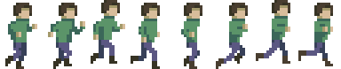

# Animated Sprites

`AnimatedSprite` extends `Sprite` and is given a spritesheet as a source.  A spritesheet is an images with multiple sprites in columns, rows, or both.  This game engine supports horizontal spritesheets:



Note: PNG-format images are great for sprites because they have a transparency layer and can be drawn on top of other images without blocking out everything behind them.

Let's look at the `AnimatedSprite`:

```js
class AnimatedSprite extends Sprite {
  constructor (config) {
    super(config)
    this.frames = config.frames // number of frames
    this.frameWidth = config.frameWidth
    this.type = 'AnimatedSprite'
    this.currentFrame = 0
    this.frameInterval()
  }

  nextFrame () {
    this.currentFrame++
    this.currentFrame %= this.frames
    /* using modulus, the currentFrame never
    exceeds the total number of frames */
  }

  frameInterval () {
    setInterval(() => {
      this.nextFrame()
    }, 100)
  }
}
```

And a quick look at how a node with an `AnimatedSprite` is drawn:

```js
if (this.sprite.type === 'AnimatedSprite') {
   /* wow, there's a lot going on in here */
  ctx.drawImage(
    this.sprite.source,
    /* but this next argument is the key */
    this.sprite.frameWidth * this.sprite.currentFrame,
    /* this changes the x-position of the image section
    which is being drawn on the canvas */
    0,
    this.sprite.frameWidth,
    this.sprite.source.height,
    this.position.x,
    this.position.y,
    this.sprite.frameWidth,
    this.sprite.source.height
  )
} 
```

You can find more info on the `drawImage` method from the ever helpful MDN docs right [here](https://developer.mozilla.org/en-US/docs/Web/API/CanvasRenderingContext2D/drawImage).