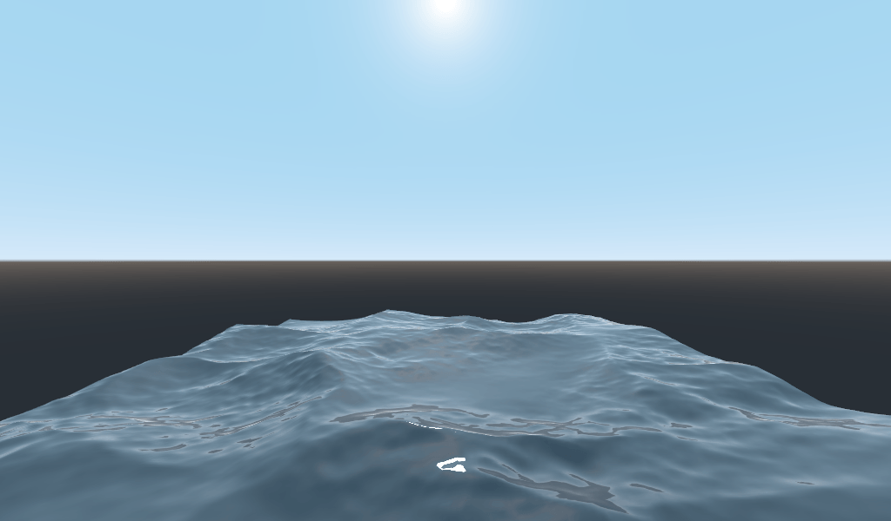

# Sprites & Trigonometric Functions

## Sprites

In 2D game design, a sprite is an image used to render a character on the screen.  In this engine, the `Sprite` class is a property that can be given to a `Scene` or `Node`.  If that property is defined, the object will draw itself with a sprite source instead of the default `ctx.fillRect` drawing.  Let's start by seeing the source images included in the HTML document:

```html
<body>

  <!-- Canvas -->
  <canvas width="800" height="600"></canvas>

  <!-- Images -->
  
  
  

  <!-- Audio -->

</body>
```

The CSS file gives all images `display: none` by default.  But, though invisible, they are still accessible in the JavaScript.  Let's take a look at the entirety of the `Sine` class:

```js
class Sine extends KinematicBody {
  constructor (config) {
    super(config)
    this.sprite = new Sprite({
      /* pass an  in as the source */
      source: document.querySelector('#sin')
    })
    this.startingPosition = new Vector2({
      x: config.x || 0,
      y: config.y || 0
    })
  }

  process (data) {
    /* data = { input, time } */
    this.position.y = this.startingPosition.y + Math.sin(data.time / 1000) * 64
  }
}
```

Speaking of `Sine`, let's talk some trigonometry.

## Trigonometric Functions

Remember how time is passed to the scene and all its children?  Let's take a look at where it comes from:

```js
function main (time = 0) {
  scene.loop(time, ctx)
  window.requestAnimationFrame(time => main(time))
}
```

`time` (in milliseconds), is the one argument passed to the [`requestAnimationFrame`](https://developer.mozilla.org/en-US/docs/Web/API/window/requestAnimationFrame) callback.  It is the amount of time since the page first loaded.  What's useful about trig functions over time, is they will return smooth, predictable values.  Tangent, if not always smooth, is definitely predictable.  Using JavaScripts `Math.sin` and `Math.cos` functions over time on the y-position creates a hover effect.  And that's just the beginning of the usefulness of mathematical properties in game design.

Shaders use mathematical functions (hardware-accelerated on the GPU) to create all kinds of cool effects.  Here is an example from the [Godot 3D Shader Tutorial](https://docs.godotengine.org/en/latest/tutorials/shaders/your_first_shader/your_first_3d_shader.html), using trig functions and perlin noise to create a water effect:

